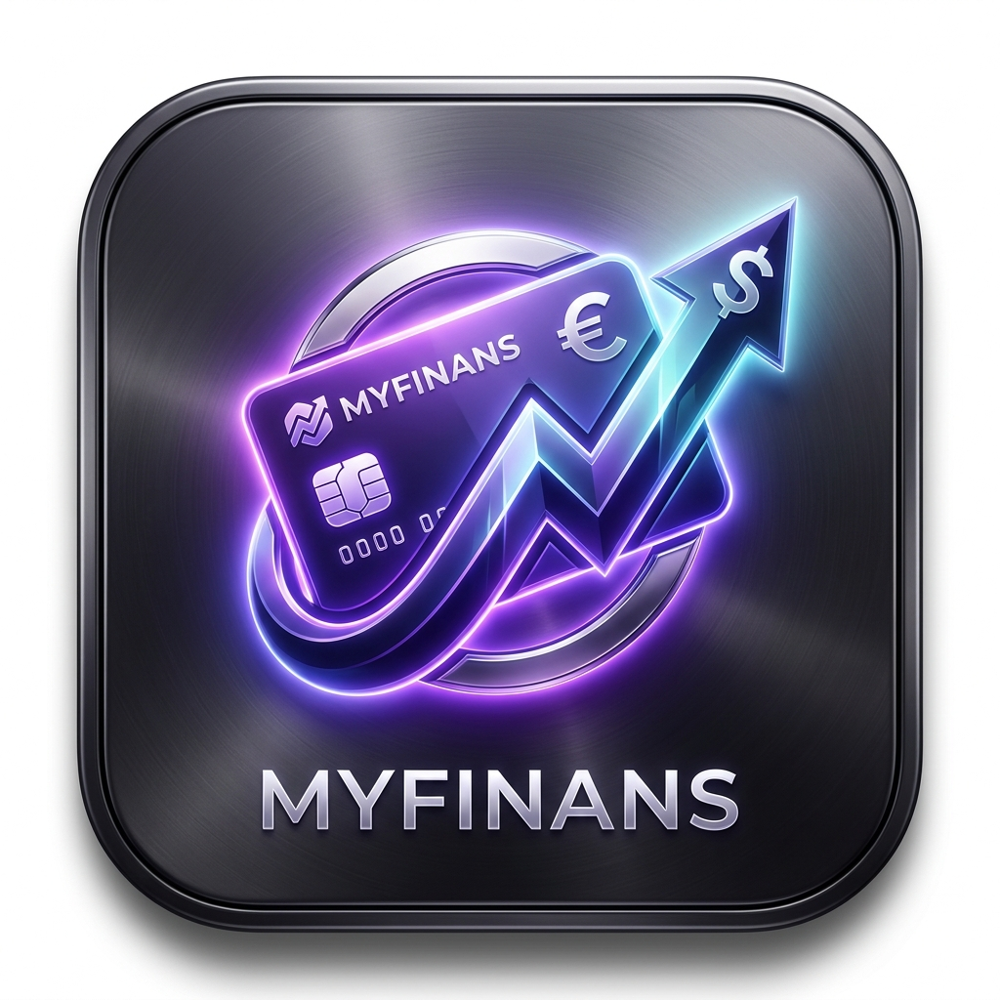
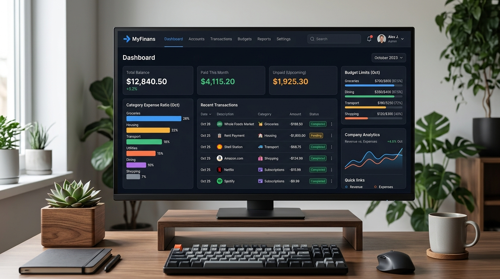
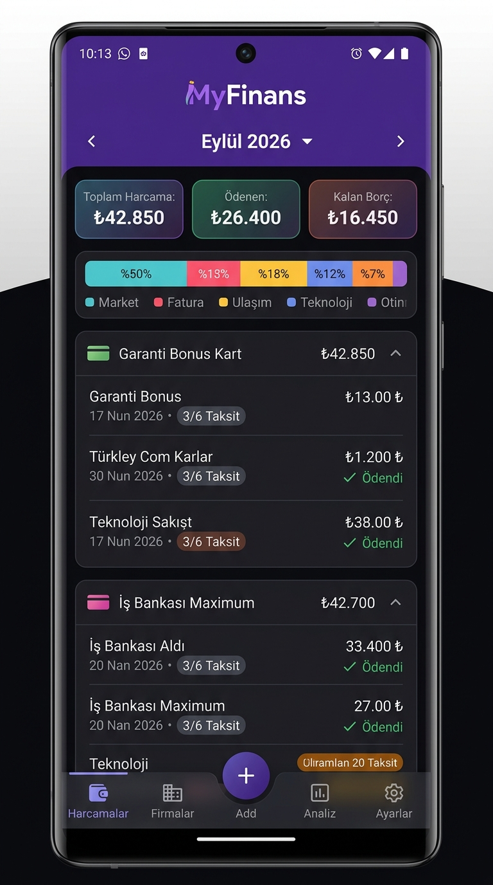
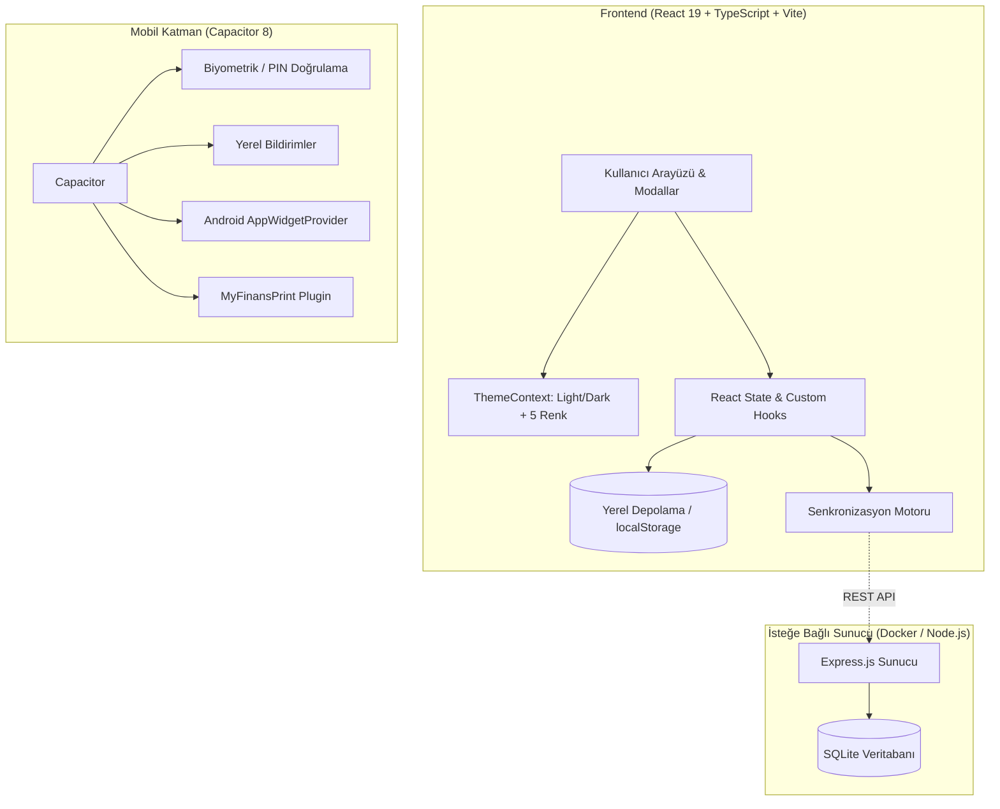

<p align="center">
  
</p>

<h1 align="center">MyFinans (v12.3)</h1>

<p align="center">
  <a href="https://github.com/eekilinc/MyFinans/releases/latest"></a>
  <a href="https://github.com/eekilinc/MyFinans/actions/workflows/release.yml"></a>
  
  
  
  
  
</p>

<p align="center">
  <strong>Bütçeni, kredi kartı ekstrelerini ve taksitlerini tek merkezden yönet.</strong><br>
  Web ve Android için gizlilik odaklı, çevrimdışı öncelikli (offline-first) hibrit kişisel finans takip sistemi.
</p>

<p align="center">
  <a href="https://github.com/eekilinc/MyFinans/releases/latest"><strong>↓ Final APK'yı İndir (v12.3)</strong></a>
  · <a href="#-ekran-görüntüleri">Ekran Görüntüleri</a>
  · <a href="#-özellikler-ve-çalışma-mantığı">Özellikler</a>
  · <a href="#-v123-ile-gelen-yenilikler">v12.3 Yenilikleri</a>
  · <a href="#-kurulum-ve-çalıştırma">Kurulum</a>
  · <a href="#-mimari-ve-teknoloji-yığını">Mimari</a>
  · <a href="#-çevrimdışı-güvenlik-ve-gizlilik">Gizlilik</a>
  · <a href="#-ci--cd-ve-imzalama">CI/CD & İmzalama</a>
</p>

---

## ⚡ Neden MyFinans?

Çoğu finans uygulaması verilerinizi üçüncü taraf sunucularda saklar, üyelik gerektirir ve internet bağlantısı olmadan çalışmaz. **MyFinans**, internet bağlantısına bağımlı olmadan çalışan, harcamalarınızı ve kredi kartı hesap kesim döngülerinizi otomatik olarak takip eden, şifreli ve çevrimdışı öncelikli bir finans yardımcısıdır.

İster bağımsız bir **Android uygulaması** olarak, ister ev sunucunuzda (Raspberry Pi, NAS veya Docker) **Web arayüzü** olarak kullanabilirsiniz.

---

## 📸 Ekran Görüntüleri

<p align="center">
  
</p>
<p align="center">
  <em>Masaüstü & Web Paneli: Geniş özet göstergeleri, kategori dağılım grafiği ve harcama grupları</em>
</p>

<br>

<p align="center">
  
</p>
<p align="center">
  <em>Android Akıllı Telefon Arayüzü: Alt gezinme barı (Harcamalar, Firmalar, Ekle, Analiz, Ayarlar) ve dokunmatik mobil deneyim</em>
</p>

---

## 💡 Özellikler ve Çalışma Mantığı

| Özellik | Nasıl Çalışır? |
| :--- | :--- |
| **Kredi Kartı Ekstre Döngüsü** | Kartın hesap kesim gününe (statement day) ve son ödeme gününe (due day) göre taksitleri ait oldukları aya otomatik yansıtır. |
| **Gelişmiş Taksit Motoru** | Taksitli alışverişlerde toplam tutarı veya aylık taksit tutarını girin; kalan taksitleri ve gelecekteki ayların ödeme planını anında hesaplar. |
| **Dinamik Bütçe Limiti & "Şimdi Ayarla"** | Aylık harcama hedefinizi belirleyin; %80, %90 ve %100 aşım seviyelerinde renkli gösterge ve anlık durum ikazları alın. Bütçe hedefi yoksa tek tıkla "Şimdi Ayarla" butonuyla kurun. |
| **Sadeleştirilmiş Top Navbar** | Masaüstü ve mobilde kalabalıktan arındırılmış, dışa aktarma işlemlerini tek açılır menüde toplayan modern üst başlık. |
| **Açık / Koyu Tema & 5 Renk Paleti** | Göz alıcı Açık Mod (Light Mode), Koyu Mod (Dark Mode) ve 5 farklı renk aksanı (Asil Mor, Zümrüt Yeşil, Okyanus Mavi, Gün Batımı, Titanyum Gri). |
| **Kapsamlı Ayarlar İçe / Dışa Aktarma** | Bütçe, tema, renk, sunucu ve dil tercihlerini JSON olarak dışa aktarın ve istediğiniz cihaza içe aktararak geri yükleyin. |
| **Mobil Alt Gezinme Barı (Bottom Dock)** | Mobil cihazlarda tek parmakla Harcamalar, Firmalar, Hızlı Ekle (+), Analiz ve her zaman görünür **Ayarlar** menüsü arasında geçiş yapın. |
| **Kategori Dağılımı ve Filtre** | Market, fatura, eğlence vb. harcamaların görsel ağırlık çubuğu üzerinden kategoriye göre tek tıkla filtreleme yapın. |
| **Hızlı İşlem Kopyalama (Duplicate)** | Her ay tekrarlanan veya benzer harcamaları tek dokunuşla cari aya çoğaltın. |
| **Evrensel Arama & Filtreleme** | Açıklama, firma, tutar aralığı ve ödeme durumuna göre anlık sonuç getiren arama motoru. |
| **Excel & CSV Dışa Aktarma** | Türkçe karakter sorunu olmayan **UTF-8 BOM** formatında tek tıkla Excel/Google Sheets uyumlu tablo çıktısı alın. |
| **PIN & Biyometrik Kilit** | 4 haneli PIN şifresi ve Android parmak izi / yüz tanıma desteğiyle finansal verilerinize izinsiz erişimi engelleyin. |
| **Android Ana Ekran Widget'ı** | Uygulamayı açmadan cari ayın toplam, ödenen ve bekleyen borçlarını ana ekrandan doğrudan takip edin. |
| **Yerel Bildirimler** | Yaklaşan hesap kesim ve son ödeme tarihlerinde gecikmeye düşmemeniz için otomatik hatırlatıcı bildirimler. |

---

## 🚀 v12.3 ile Gelen Yenilikler

- 📊 **Koyu Temada Gösterge Paneli Yüksek Kontrastı**: Aylık toplam harcama, ödenen ve kalan gösterge kartlarının koyu temadaki bulanık/çamurlu arka planı kaldırılarak derin, katmanlı ve net zeminler (`bg-slate-900 border-slate-800 shadow-2xl`) getirildi. Başlıklar, tutarlar ve alt durum açıklamaları karanlık modda anında okunan parlak ve canlı renklere dönüştürüldü.
- ⚙️ **Ayarlar Menüsünde Sekmeli (Tabbed) Tasarım & "Hakkında" Bölümü**:
  - Ayarlar penceresi uzun dikey kaydırma yerine *Görünüm*, *Bütçe*, *Güvenlik*, *Yedekleme & Aktarım*, *Senkronizasyon* ve *Hakkında* sekmelerine ayrıldı.
  - "Hakkında" bölümü eklenerek MyFinans logosu, sürüm, geliştirici (@eekilinc), %100 çevrimdışı gizlilik mimarisi, MIT lisansı ve doğrudan GitHub/Releases bağlantıları entegre edildi.
- 📱 **Android Kurulum Simgesi (App Icon) Tamamen Yenilendi**: Android 8.0+ (API 26+) adaptive icon yapısı (`ic_launcher_foreground`, `ic_launcher_round`, `ic_launcher_background`) baştan üretildi. Telefona kurulduğunda çıkan varsayılan React/Capacitor logosu kaldırılarak safe-zone hizalı özel 3D MyFinans fintech logosu entegre edildi.
- 🖼️ **Android Açılış Ekranı (Splash Screen)**: Android telefonlarda açılış ekranı karanlık fintech teması ve parlak MyFinans logosu ile tüm ekran yoğunluklarında (mdpi, hdpi, xhdpi, xxhdpi, xxxhdpi) güncellendi.
- ☀️ **Tüm Kartlar ve Pencerelerde Tam Açık/Koyu Tema Uyumu**:
  - Giderler listesi, işlem kartları (`TransactionItem`), harcama grubu kartları (`ExpenseGroupCard`), yaklaşan ödemeler (`UpcomingTimeline`), kategori dağılımı (`CategoryBreakdown`) ve firma istatistikleri (`CompanyStatsView`) açık temada temiz beyaz/gri ve yüksek okunabilirliğe kavuşturuldu.
  - Harcama ekleme/düzenleme (`TransactionModal`), grup yönetimi (`GroupModal`), firma detayları (`CompanyDetailModal`), evrensel arama (`SearchModal`) ve ayarlar (`SettingsModal`) pencerelerindeki tüm form alanları ve butonlar açık/koyu temaya tam duyarlı hale getirildi.
- 🧭 **Top Navbar Sadeleştirmesi**: Üst gezinme çubuğundaki Ayarlar butonu kaldırılarak, tek noktadan ve başparmakla kolayca erişilen mobil alt dock (Bottom Navigation) ile sade, dengeli ve mükemmel bir gezinme deneyimi sağlandı.

---

## 🚀 v12.2 ile Gelen Yenilikler

- 🧭 **Sadeleştirilmiş ve Ferah Top Navbar**: Üst bardaki yan yana duran dağınık butonlar kaldırıldı. Raporlama ve aktarım araçları şık bir **"Dışa Aktar"** açılır menüsünde toplandı. Arama ve tema araçları minimalist hale getirildi.
- ☀️ **Kusursuz Açık Tema (Light Mode)**: Açık tema arka planı, kartları, kenarlıkları ve metin kontrastları baştan sona yeniden tasarlandı; yüksek okunabilirlik ve modern beyaz/açık gri arayüz sağlandı.
- 🎨 **5 Farklı Renk Paleti (Theme Accents)**:
  - 💜 **Asil Mor (Royal Purple)**
  - 💚 **Zümrüt Yeşil (Emerald Green)**
  - 💙 **Okyanus Mavi (Ocean Blue)**
  - 🧡 **Gün Batımı (Sunset Rose)**
  - 🖤 **Titanyum Gri (Titanium Slate)**
- 📥 **Ayarları İçe ve Dışa Aktarma (Settings Import / Export)**:
  - Sadece harcamalar değil; aylık bütçe limiti, aktif tema modu, seçili renk paleti, dil ve sunucu ayarlarını içeren bağımsız `MyFinans_Ayarlar.json` dışa/içe aktarma motoru eklendi.
  - Veritabanı ve ayarları tek pakette birleştiren **Tam Yedekleme** desteği sunuldu.
- 📱 **Tam Mobil Uyumluluk & Mobil Alt Bar (Bottom Dock)**: Akıllı telefonlar için optimize edilmiş `MobileBottomNav` ile Harcamalar, Firmalar, Hızlı Ekle (+), Analiz ve **Ayarlar** menülerine tek başparmak hareketiyle anında ulaşılır.
- ⚙️ **Garantili "Şimdi Ayarla" Erişimi**: Ayarlar menüsü hem mobil üst başlıkta, hem alt gezinme çubuğunda hem de gösterge panelindeki *"Şimdi Ayarla"* butonuyla sabitlendi.
- 🎨 **Özel Uygulama Logosu & Android Simgeleri**: Yüksek kaliteli modern fintech simgesi üretildi; PWA favicon, Android `ic_launcher` (mdpi, hdpi, xhdpi, xxhdpi, xxxhdpi) ve splash screen görselleri yenilendi.

---

## 🛠 Mimari ve Teknoloji Yığını



- **Frontend**: React 19, TypeScript 5, Vite 8, Tailwind CSS v4, Lucide React, i18next (Türkçe & İngilizce).
- **Mobil**: Android SDK (API 36 / Android 14+), Capacitor 8, Native Biometrics, Local Notifications, Native AppWidget.
- **Backend (Opsiyonel)**: Node.js 20/22, Express, SQLite3, Docker & Docker Compose.

---

## 💻 Kurulum ve Çalıştırma

### 1. Android APK Kurulumu (En Kolay)
1. [Releases](https://github.com/eekilinc/MyFinans/releases/latest) sayfasından en güncel `MyFinans-v12.2.0.apk` dosyasını Android telefonunuza indirin.
2. İndirilen APK dosyasına dokunup kurulumu tamamlayın.
3. Uygulama tamamen çevrimdışı çalışmaya hazırdır!

### 2. Web & Geliştirici Ortamı
```bash
# Depoyu klonlayın
git clone https://github.com/eekilinc/MyFinans.git
cd MyFinans

# Frontend bağımlılıklarını kurun ve çalıştırın
cd frontend
npm install
npm run dev
```

### 3. Docker ile Sunucu Kurulumu
Ev sunucunuzda çalıştırmak için:
```bash
docker compose up -d --build
```
Uygulama `http://localhost:3000` adresinde hazır olacaktır.

---

## 🤖 CI / CD ve Otomatik Sürümleme

Bu depoda GitHub Actions üzerinden tam otomatik derleme ve dağıtım hattı mevcuttur:

1. Yeni bir sürüm etiketi (`tag`) oluşturup itin:
   ```bash
   git tag v12.2.0
   git push origin v12.2.0
   ```
2. `.github/workflows/release.yml` otomatik devreye girer:
   - Node.js 22, Java 21 ve Android SDK ortamlarını kurar.
   - Frontend lint ve build adımlarını çalıştırır.
   - Capacitor senkronizasyonu yapar.
   - Keystore ile Release APK'yı derler ve APK Signature v2 ile imzalar.
   - GitHub Release oluşturup `MyFinans-v12.2.0.apk` dosyasını otomatik olarak yayınlar.

---

## 🔐 Çevrimdışı Güvenlik ve Gizlilik

- **Sıfır Telemetri**: Uygulamada hiçbir izleme kodu (telemetry), analitik veya reklam SDK'sı bulunmaz.
- **Yerel Veri Saklama**: Verileriniz yalnızca cihazınızın güvenli yerel depolama alanında saklanır.
- **İnternetsiz Tam İşlevsellik**: Uçak modunda dahi tüm hesaplamalar, ekstre takipleri ve filtrelemeler eksiksiz çalışır.

---

## 📄 Lisans

Bu proje [MIT Lisansı](LICENSE) altında açık kaynak olarak sunulmaktadır.
Dilediğiniz gibi geliştirebilir, kişiselleştirebilir ve kullanabilirsiniz.
