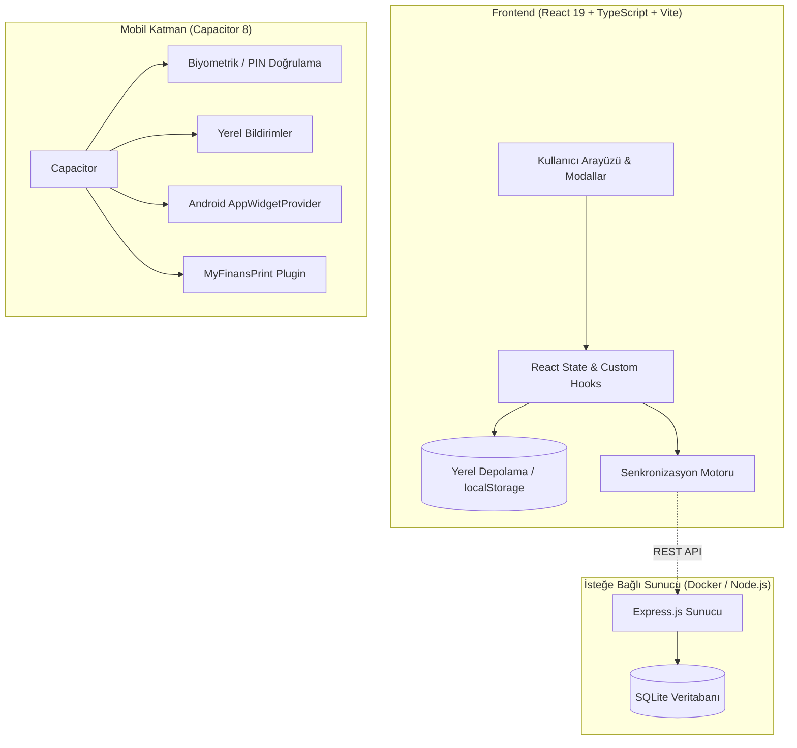

<p align="center">
  
</p>

<h1 align="center">MyFinans (v12.0)</h1>

<p align="center">
  <a href="https://github.com/eekilinc/MyFinans/releases/latest"></a>
  <a href="https://github.com/eekilinc/MyFinans/actions/workflows/release.yml"></a>
  
  
  
  
  
</p>

<p align="center">
  <strong>Bütçeni, kredi kartı ekstrelerini ve taksitlerini tek merkezden yönet.</strong><br>
  Web ve Android için gizlilik odaklı, çevrimdışı öncelikli (offline-first) hibrit kişisel finans takip sistemi.
</p>

<p align="center">
  <a href="https://github.com/eekilinc/MyFinans/releases/latest"><strong>↓ Final APK'yı İndir (v12.0)</strong></a>
  · <a href="#-özellikler-ve-çalışma-mantığı">Özellikler</a>
  · <a href="#-120-ile-gelen-yenilikler">v12.0 Yenilikleri</a>
  · <a href="#-kurulum-ve-çalıştırma">Kurulum</a>
  · <a href="#-mimari-ve-teknoloji-yığını">Mimari</a>
  · <a href="#-çevrimdışı-güvenlik-ve-gizlilik">Gizlilik</a>
  · <a href="#-ci--cd-ve-imzalama">CI/CD & İmzalama</a>
</p>

---

## ⚡ Neden MyFinans?

Çoğu finans uygulaması verilerinizi üçüncü taraf sunucularda saklar, üyelik gerektirir ve internet bağlantısı olmadan çalışmaz. **MyFinans**, internet bağlantısına bağımlı olmadan çalışan, harcamalarınızı ve kredi kartı hesap kesim döngülerinizi otomatik olarak takip eden, şifreli ve çevrimdışı öncelikli bir finans yardımcısıdır.

İster bağımsız bir **Android uygulaması** olarak, ister ev sunucunuzda (Raspberry Pi, NAS veya Docker) **Web arayüzü** olarak kullanabilirsiniz.

---

## 💡 Özellikler ve Çalışma Mantığı

| Özellik | Nasıl Çalışır? |
| :--- | :--- |
| **Kredi Kartı Ekstre Döngüsü** | Kartın hesap kesim gününe (statement day) ve son ödeme gününe (due day) göre taksitleri ait oldukları aya otomatik yansıtır. |
| **Gelişmiş Taksit Motoru** | Taksitli alışverişlerde toplam tutarı veya aylık taksit tutarını girin; kalan taksitleri ve gelecekteki ayların ödeme planını anında hesaplar. |
| **Dinamik Bütçe Limiti** | Aylık harcama hedefinizi belirleyin; %80, %90 ve %100 aşım seviyelerinde renkli gösterge ve anlık durum ikazları alın. |
| **Kategori Dağılımı ve Filtre** | Market, fatura, eğlence vb. harcamaların görsel ağırlık çubuğu üzerinden kategoriye göre tek tıkla filtreleme yapın. |
| **Hızlı İşlem Kopyalama (Duplicate)** | Her ay tekrarlanan veya benzer harcamaları tek dokunuşla cari aya çoğaltın. |
| **Evrensel Arama & Filtreleme** | Açıklama, firma, tutar aralığı ve ödeme durumuna göre anlık sonuç getiren arama motoru. |
| **Firma ve Satıcı Analitiği** | Hangi firmaya toplam ne kadar ödeme yaptığınızı, işlem adedini ve son işlem tarihini tek bakışta izleyin; hızlı firma adı düzeltme imkanı. |
| **Excel & CSV Dışa Aktarma** | Türkçe karakter sorunu olmayan **UTF-8 BOM** formatında tek tıkla Excel/Google Sheets uyumlu tablo çıktısı alın. |
| **PIN & Biyometrik Kilit** | 4 haneli PIN şifresi ve Android parmak izi / yüz tanıma desteğiyle finansal verilerinize izinsiz erişimi engelleyin. |
| **Android Ana Ekran Widget'ı** | Uygulamayı açmadan cari ayın toplam, ödenen ve bekleyen borçlarını ana ekrandan doğrudan takip edin. |
| **Yerel Bildirimler** | Yaklaşan hesap kesim ve son ödeme tarihlerinde gecikmeye düşmemeniz için otomatik hatırlatıcı bildirimler. |
| **Yedekleme ve Geri Yükleme** | Tüm verinizi tek bir JSON dosyası olarak şifrelenmiş şekilde dışa aktarın, dilediğiniz cihaza aktarın. |

---

## 🚀 12.0 ile Gelen Yenilikler

- 🎨 **Modern ve Modüler Tasarım**: `App.tsx` monolith yapısı modüler bileşenlere (`DashboardSummary`, `CategoryBreakdown`, `UpcomingTimeline`, `ExpenseGroupCard`, `CompanyStatsView`, `HistoryTrendsView`, `Toast`) ayrıştırıldı.
- 📊 **Kategori Dağılım Grafiği**: Aylık harcamaların kategorik yüzdelerini ve toplamlarını gösteren interaktif görsel oran çubuğu.
- 📥 **UTF-8 BOM Destekli CSV / Excel Aktarımı**: Türkçe karakterlerin Excel'de bozulmadan açılmasını sağlayan profesyonel veri dışa aktarma motoru.
- ⚡ **Hızlı İşlem Kopyalama**: Mevcut harcama kayıtlarını tek tıkla kopyalayarak yeni kayıt açma kolaylığı.
- 🎯 **Dinamik Bütçe Göstergesi**: Ay bazlı harcama limiti belirleme ve görsel doluluk ibresi.
- 🔍 **Evrensel Arama Modalı**: Tüm aylar ve harcamalar içinde anahtar kelime, satıcı ve tutara göre arama.
- 🔒 **Android Güvenlik & İmzalama (v2 Scheme)**: Gradle imzalama konfigürasyonu tamamlandı, release APK'sı Android v2 Signature ile doğrulandı.
- 🤖 **GitHub Actions CI/CD**: Otomatik etiket (`v*.*.*`) tetiklemeli APK derleme, imzalama, artifact yükleme ve GitHub Release oluşturma iş akışı entegre edildi.

---

## 🛠 Mimari ve Teknoloji Yığını



- **Frontend**: React 19, TypeScript 5, Vite 8, Tailwind CSS v4, Lucide React, i18next (Türkçe & İngilizce).
- **Mobil**: Android SDK (API 36 / Android 14+), Capacitor 8, Native Biometrics, Local Notifications, Native AppWidget.
- **Backend (Opsiyonel)**: Node.js 20, Express, SQLite3, Docker & Docker Compose.

---

## 💻 Kurulum ve Çalıştırma

### 1. Android APK Kurulumu (En Kolay)
1. [Releases](https://github.com/eekilinc/MyFinans/releases/latest) sayfasından en güncel `MyFinans-v12.0.apk` dosyasını Android telefonunuza indirin.
2. İndirilen APK dosyasına dokunup kurulumu tamamlayın.
3. Uygulama tamamen çevrimdışı çalışmaya hazırdır!

### 2. Web & Geliştirici Ortamı
```bash
# Depoyu klonlayın
git clone https://github.com/eekilinc/MyFinans.git
cd MyFinans

# Frontend bağımlılıklarını kurun ve çalıştırın
cd frontend
npm install
npm run dev
```

### 3. Docker ile Sunucu Kurulumu
Ev sunucunuzda çalıştırmak için:
```bash
docker compose up -d --build
```
Uygulama `http://localhost:3000` adresinde hazır olacaktır.

---

## 📱 Android Derleme ve İmzalama (Geliştiriciler İçin)

```bash
# 1. Frontend derlemesini hazırlayın
cd frontend
npm run build
npx cap sync android

# 2. Android SDK yolunu tanımlayın
export ANDROID_HOME=/yolunuz/android-sdk

# 3. İmzalı Release APK üretin
cd android
./gradlew assembleRelease

# Çıktı dosyası:
# frontend/android/app/build/outputs/apk/release/app-release.apk
```

---

## 🤖 CI / CD ve Otomatik Sürümleme

Bu depoda GitHub Actions üzerinden tam otomatik derleme ve dağıtım hattı mevcuttur:

1. Yeni bir sürüm etiketi (`tag`) oluşturup itin:
   ```bash
   git tag v12.0.0
   git push origin v12.0.0
   ```
2. `.github/workflows/release.yml` otomatik devreye girer:
   - Node.js, Java 17 ve Android SDK ortamlarını kurar.
   - Frontend lint ve build adımlarını çalıştırır.
   - Capacitor senkronizasyonu yapar.
   - Keystore ile Release APK'yı derler ve APK Signature v2 ile imzalar.
   - GitHub Release oluşturup `MyFinans-v12.0.0.apk` dosyasını otomatik olarak yayınlar.

---

## 🔐 Çevrimdışı Güvenlik ve Gizlilik

- **Sıfır Telemetri**: Uygulamada hiçbir izleme kodu (telemetry), analitik veya reklam SDK'sı bulunmaz.
- **Yerel Veri Saklama**: Verileriniz yalnızca cihazınızın güvenli yerel depolama alanında saklanır.
- **İnternetsiz Tam İşlevsellik**: Uçak modunda dahi tüm hesaplamalar, ekstre takipleri ve filtrelemeler eksiksiz çalışır.

---

## 📄 Lisans

Bu proje [MIT Lisansı](LICENSE) altında açık kaynak olarak sunulmaktadır.
Dilediğiniz gibi geliştirebilir, kişiselleştirebilir ve kullanabilirsiniz.
